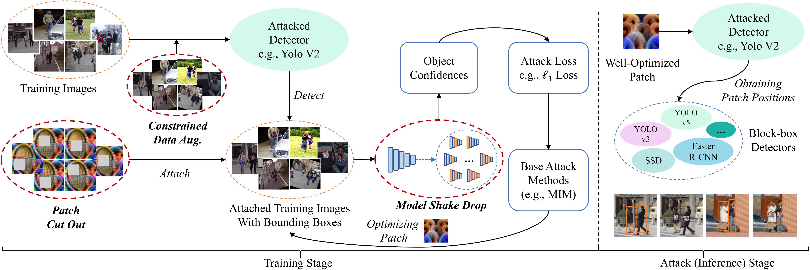

# T-SEA: Transfer-based Self-Ensemble Attack on Object Detection

[**English**](https://github.com/VDIGPKU/T-SEA/blob/main/README.md)
| [**中文**](https://github.com/VDIGPKU/T-SEA/blob/main/README-cn.md)

[**Paper**](https://arxiv.org/abs/2211.09773)
| Hao Huang, Ziyan Chen, Huanran Chen, Yongtao Wang, Kevin Zhang

T-SEA官方执行代码仓库, 同时该仓库提供了一个用来制作通用（跨模型&跨实例）对抗补丁的检测-攻击框架，同时提供了测试及训练模块。



如果本仓库对您的工作有帮助，请帮忙点亮star~ Thanks! :-D

## 更新
* 2022.11.21 - 修复已知的训练/测试脚本的运行bug。
* 2022.11.18 - 创建本仓库。


## 安装
### 环境
```bash
conda create -n tsea python=3.7
conda activate tsea
pip install -r requirements.txt
```

### 模型 & 数据
请确保您已经准备好了预训练模型及数据。需要准备的文件主要包括：
* 模型: 预训练的检测器模型权重。
* 数据: 图片数据(必需)、对应的标注标签(可选，测试时选用) & 对应的检测标签(可选，测试时选用）。


#### 数据
```bash
# 请将数据放在data/路径下
# 标签文件所在目录文件树示意如下：
├── data
    ├── INRIAPerson
        ├── Train
        ├── Test
            ├── pos # 图片数据
            ├── labels # 标签数据
                ├── faster_rcnn-rescale-labels
                ├── ground-truth-rescale-labels
                ├── ...
```

**下载**
本仓库支持从给定的模型中生成检测标签，在**utils/preprocessor/README.md**查看更多细节介绍。
我们在[**GoogleDrive**](https://drive.google.com/drive/folders/1GzdvnLgKGiPDfitc8bIa-a76e_2Mz_Fl?usp=share_link)
| [**BaiduCloud**](https://pan.baidu.com/s/1WnjbEhYnipmGfC-TrhW-OQ?pwd=85d3)
提供了实验数据，包括基于数据集检测标签及对抗补丁demo。

#### 模型
您可以通过以下命令来下载模型权重：
```bash
# 在项目根目录执行以下命令
# 下载模型权重
bash ./detlib/weights/download.sh
# 将模型权重链接到对应的检测器目录
bash ./detlib/weights/setup.sh
```
您也可以通过上述的云盘链接来下载支持模型的权重文件。

权重文件所在目录文件树结构如下：
```bash
# 权重文件所在路径目录树如下所示：
└── detlib
    ├── base.py
    ├── HHDet
    ├── torchDet
    └── weights
        ├── setup.sh
        ├── yolov2.weights
        ├── yolov3-tiny.weights
        ├── ...
```

### 运行
#### 对抗补丁测试

我们提供了 **Mean Average Precision(mAP)** 作为测试量化指标。 
```bash
# 直接运行提供的示例脚本来对抗补丁样例测试
bash ./scripts/eval.sh 0 # gpu id
```

```bash
# 或运行完整命令来进行自定义测试，在项目根目录执行：
# 测试yolo-models(coco80):
# 替换$PROJECT_DIR为项目根目录绝对路径
python evaluate.py \
-p ./results/v5-demo.png \
-cfg ./configs/eval/coco80.yaml \
-lp $PROJECT_DIR/data/INRIAPerson/Test/labels \
-dr $PROJECT_DIR/data/INRIAPerson/Test/pos \
-s $PROJECT_DIR/data/test \
-e 0 # 攻击类别id
# 测试torch-models(coco91): 
# 以./configs/eval/coco91.yaml作为-cfg参数运行上述命令


# 查看参数帮助
python evaluate.py -h
```
#### 对抗补丁训练
```bash
# 直接运行提供的脚本来进行一个demo对抗补丁的训练
bash ./scripts/train.sh 0 -np
# 参数: 0 gpu-id, -np 启动一个新的tensorboard进程
```

```bash
# 或者通过运行完整命令来自定义对抗补丁训练
python train_optim.py -np \
-cfg=demo.yaml \
-s=./results/demo \
-n=v5-combine-demo # 对抗补丁保存图片名&tensorboard日志文件名

# 查看参数帮助
python train_optim.py -h
```
您可以通过修改configs文件夹下的.yaml文件来自定义设置，在**configs/README.yaml**中可以查看对设置的细节介绍。


## 框架概览
我们提供了一个制作通用（跨模型&跨实例）对抗补丁的检测-攻击框架，同时提供了测试及训练模块。

该检测-攻击框架主要包含三个核心模块Attack, Detlib & Utils： 
* **Detlib**
Detlib为检测库，实现基础的检测器以及对检测器统一调用的API方法。
本框架的模型扰动（例如Shakedrop）在检测模块内部实现。
  * **HHDet** (PyTorch) - Yolo V2, V3, V3-tiny, V4, V4tiny, V5
    * See **acknowledgements** in README.md in the main project directory.
  * **TorchDet** (PyTorch) - Faster RCNN(renet50), ssd(vgg16) & ssdlite(mobilenet v3 large)
    * Rewritten from Torch official detection models.

  * **模型自定义** - 您可以基于本框架自定义攻击模型，在**detlib/README.md**中可以查看更多细节介绍。


* **Attack Lib**
Attack Lib攻击算法库，负责实现基础攻击方法及一个核心攻击代理类。
  * **基础攻击算法**
      * 基于FGSM的基础攻击算法: **BIM**, **MIM** & **PGD**.
      * 基于优化器的攻击方法: **SGD** & **Adam**.

* **Utils**
  * Config parser, data preprocessing utils
  * solver - loss fn & schedulers
  * metrics - mAP 
  * Plot - TensorBoard utils
  
对应模块中的README.md文件有关于模块中方法的详细阐述。

## Acknowledgements

### Data
* INRIAPerson [Paper](https://hal.inria.fr/docs/00/54/85/12/PDF/hog_cvpr2005.pdf)
* COCO-person(from COCO) [HomePage](https://cocodataset.org/#home)
* CCTV-person [Source](https://www.kaggle.com/datasets/constantinwerner/human-detection-dataset)

### Detlib
* **HHDet**
  * Yolo V2 [**PyTorch implementation**](https://github.com/ayooshkathuria/pytorch-yolo2)
  | [**Paper**](https://arxiv.org/abs/1506.02640)
  | [**Page**](https://pjreddie.com/darknet/yolo/)
  * Yolo V3 [**PyTorch implementation**](https://github.com/eriklindernoren/PyTorch-YOLOv3)
  | [**Paper**](https://arxiv.org/abs/1804.02767v1)
  | [**Page**](https://pjreddie.com/darknet/yolo/)
  * Yolo V4 [**PyTorch implementation**](https://github.com/Tianxiaomo/pytorch-YOLOv4)
  | [**Paper**](https://arxiv.org/abs/2004.10934)
  | [**Source Code**](https://github.com/AlexeyAB/darknet)
  * Yolo V5 [**PyTorch implementation**](https://github.com/ultralytics/yolov5)
* **TorchDet**: 采用PyTorch官方库提供的检测模型（部分经改写）
  * FasterRCNN(resnet50 & mobilenet-v3 large), ssd(vgg16) & ssdlite(mobilenet-v3 large).


### Attack Lib
* **Reference**: Fooling automated surveillance cameras: adversarial patches to attack person detection.
[**Source Code**](https://gitlab.com/EAVISE/adversarial-yolo)
| [**Paper**](http://openaccess.thecvf.com/content_CVPRW_2019/papers/CV-COPS/Thys_Fooling_Automated_Surveillance_Cameras_Adversarial_Patches_to_Attack_Person_Detection_CVPRW_2019_paper.pdf)

### Utils
* **Metrics**
  * mAP [**Implementation**](https://github.com/Cartucho/mAP).
* **Plot**
  * Tensorboard.

## 联系我们
如果您对本工作有疑问，欢迎通过邮件`huanghao@stu.pku.edu.cn`联系我们.