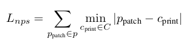
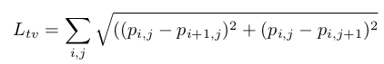
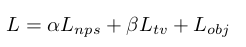
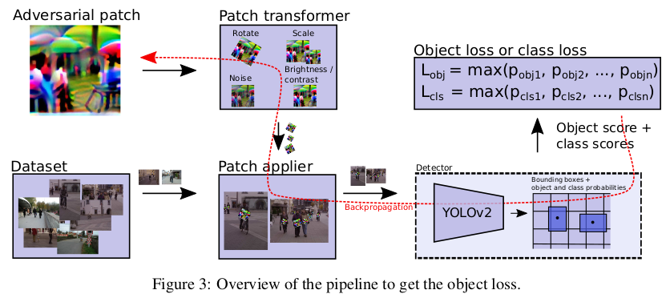
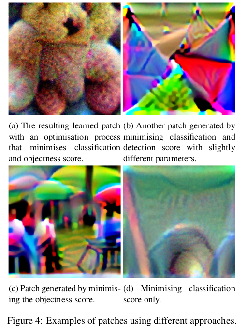
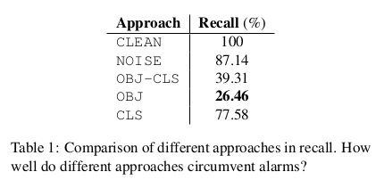
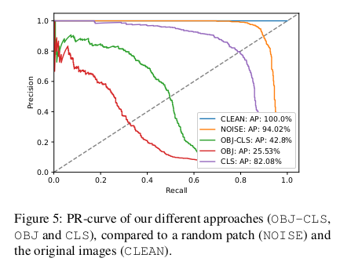
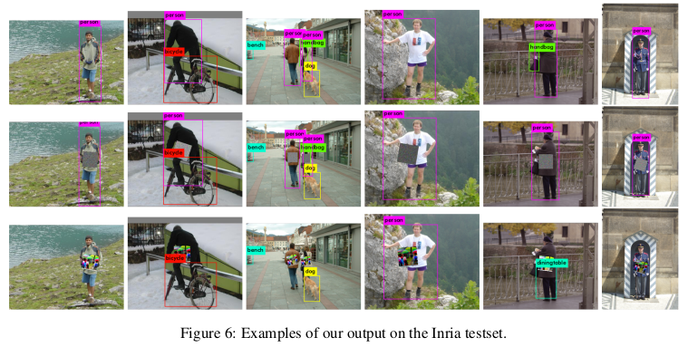

# Fooling automated surveillance cameras: adversarial patches to attack person detection(CVPR2019)

paper：https://arxiv.org/abs/1904.08653

总结：

针对人的检测器对抗补丁攻击。

损失函数：

- 实际颜色和打印颜色的相似度得分。
- 相邻像素的相似度得分。

- 最大目标对象的置信度得分。

过程：

1.首先在图像数据集上运行目标人物检测器。这会产生边界框，根据检测器显示图像中人物出现的位置。

2.然后将补丁贴在图上相对于这些边界框的固定位置上。（为保证补丁的鲁棒会将补丁应用到图像前会进行随机小角度的旋转，缩放，加噪声和亮度对比度变换）

3.然后将所得图像与其他图像一起批量送入检测器，测量仍然被检测到的人的分数，用它来计算损失函数。

4.然后优化器使用整个网络上的反向传播，进一步更改补丁中的像素，以进一步欺骗检测器。

## 摘要

目前的对抗攻击方法的目标类别几乎不包含类别内的变化（例如停车标志）。然后**使用该对象的已知结构在其上生成对抗性补丁**。在本文中，我们提出了一种为具有大量类内多样性的目标（即人）生成对抗性补丁的方法。目标是生成一个能够成功地将人隐藏在人员检测器之外的补丁。例如，这种攻击可能被恶意用来规避监控系统，入侵者可以通过将一块小纸板放在身体前面，瞄准监控摄像头，在不被发现的情况下潜行。从我们的结果可以看出，我们的系统能够显着降低人体检测器的准确性。我们的方法在由相机拍摄补丁的现实场景中也能很好地发挥作用。据我们所知，我们是第一个尝试对具有高水平内部多样性的目标（例如人员）进行此类攻击的人。

## 方法

## 3.生成人检测器的对抗补丁

这项工作的目标是创建一个能够生成可打印的对抗性补丁的系统，该补丁可用于欺骗人体探测器。陈等人和艾克霍特等人研究 [18]已经表明，现实世界中对物体检测器的对抗性攻击是可能的。在他们的工作中，他们的目标是停车标志，在这项工作中，我们关注的是那些与停车标志的统一外观不同的人，他们的变化可能更大。使用优化过程（在图像像素上），我们尝试找到一个在大型数据集上有效降低人物检测准确性的补丁。在本节中，我们将深入解释生成这些对抗性补丁的过程。我们的优化目标由三部分组成：

- $L_{nps}$ 不打印性分数[17]，该因素表示普通打印机可以很好地呈现我们的色块中的颜色。给出：

其中的$p_{patch}$是我们的 patch $P$ 中的一个像素，$c_{print}$ 是一组可打印颜色 $C$ 中的一种颜色。这种损失有利于我们图像中与我们可打印颜色组中的颜色接近的颜色。

- $L_{tv}$ 图像的总变化如[17]中所述。这种损失可确保我们的优化器偏爱具有平滑颜色过渡的图像并防止出现噪声图像。我们可以根据patch $P$ 计算 $L_tv$ ，如下所示：

当相邻的像素都相似时分数会低，当相邻像素不同时分数会不同。

- $L_{obj}$ 图像中的最大对象得分。我们补丁的目标是隐藏图像中的人物。为此，我们训练的目标是最小化检测器输出的对象或类别分数。本节稍后将深入讨论此分数。

总的loss损失为：

我们取根据经验确定的因子$\alpha$和 $\beta$缩放的三个损失的总和，并使用 Adam [10] 算法进行优化。

​	**我们优化器的目标是最小化总损失$L$。在优化过程中，我们冻结网络中的所有权重，并仅更改补丁中的值。补丁在过程开始时使用随机值进行初始化。	**图 3 概述了如何计算对象损失。遵循相同的过程来计算类别概率。在本节的其余部分中，我们将深入解释这是如何完成的。

### 3.1 最小化检测器输出的置信度

YOLOv2 目标检测器输出一个单元格网格，每个单元格包含一系列锚点（默认为 5 个）。每个锚点包含边界框的位置、对象概率和类别分数。为了让检测器忽略人，我们尝试了三种不同的方法：我们可以最小化类别人的分类概率（图 4d 中的示例补丁，最小化对象分数（图 4c），或者两者的结合（图 4b 和 4a）。在我们使用在 MS COCO 数据集上训练的 YOLO 检测器的实验中，我们尝试了最小化类别分数的方法。 我们发现生成的补丁在 COCO 数据集中被检测为另一个类，图 4a 和 4b 是采用类和对象概率的乘积的示例，在图 4a 的情况下，学习的补丁最终类似于一个泰迪熊，它在视觉上也很相似，“泰迪熊”类似乎压倒了“人”类，但是，因为该补丁开始类似于另一个类，所以该补丁很难转移到在数据集上训练的其他模型。

我们提出的最小化对象分数的另一种方法不存在这个问题。尽管我们在优化过程中仅将其放在人员之上，但与其他方法相比，生成的补丁对于特定类别的针对性较差。图 4c 显示了此类补丁的示例。

### 3.2 训练数据集的准备

与之前在停车标志上所做的工作相比 [5, 18]，为类别人创建对抗性补丁更具挑战性：

- 人们的外表变化更大：衣服、肤色、身材、姿势……与总是具有相同八角形形状且通常为红色的停车标志相比。 

- 人们可以出现在许多不同的环境中。停车标志大多出现在街道一侧的相同环境中。 

- 一个人的外观会根据一个人是否背对相机或朝向相机而有所不同。

- 一个人身上没有一致的位置可以放置我们的补丁。在停车标志上，很容易计算出补丁的确切位置。

在本节中，我们将解释我们如何应对这些挑战。首先，我们使用不同人的真实图像，而不是像[5, 18]中那样人为地修改目标对象的单个图像并进行不同的变换。我们的工作流程如下：

**我们首先在图像数据集上运行目标人物检测器。这会产生边界框，根据检测器显示图像中人物出现的位置。然后，在相对于这些边界框的固定位置上，我们将补丁的当前版本应用到不同变换下的图像（为保持鲁棒性做的一系列随机变换）。然后将所得图像（与其他图像一起批量）送入检测器。我们测量仍然被检测到的人的分数，用它来计算损失函数。然后，优化器使用整个网络上的反向传播，进一步更改补丁中的像素，以进一步欺骗检测器。**

这种方法使我们不仅限于带注释的数据集。任何视频或图像集合都可以输入目标检测器以生成边界框。这使得我们的系统也可以进行更有针对性的攻击。当我们从目标环境中获得可用数据时，我们可以简单地使用该素材来生成特定于该场景的补丁。这可能会比通用数据集表现得更好。在我们的测试中，我们使用 Inria [6] 数据集的图像。这些图像更针对全身行人，更适合我们的监控摄像头应用。我们承认像 MS COCO [11] 和 Pascal VOC [7] 等更具挑战性的数据集是可用的，但它们包含太多的人物出现的多样性（例如一只手被注释为人），使得我们很难将我们的补丁放入其中一致的位置。

### 3.3 使补丁更加健壮 

**我们的目标是必须在现实世界中使用的补丁。这意味着它们首先被打印出来，然后用摄像机拍摄。**执行此操作时，许多因素都会影响贴片的外观：照明可能会发生变化，贴片可能会稍微旋转，贴片相对于人的大小可能会发生变化，相机可能会增加噪点或稍微模糊贴片，视角可能会有所不同。 为了尽可能考虑到这一点，我们在将补丁应用到图像之前对其进行一些转换。我们进行以下随机变换：

- patch在每个方向旋转最多 20 度。
- patch随机缩放
- patch添加随机噪声
- patch进行随机亮度和对比度改变

在整个过程中，重要的是要注意，对于patch必须仍然可以计算所有操作的向后梯度。

## 4.结果

​	在本节中我们评估补丁的有效性。我们通过将补丁应用到 Inria 测试集来评估补丁，使用的过程与我们在训练期间使用的过程相同，包括随机变换。在我们的实验中，我们试图最小化一些可能隐藏人物的不同参数。作为对照，我们还将我们的结果与包含随机噪声的补丁进行比较，该补丁的评估方式与随机补丁完全相同。图 5 显示了我们不同补丁的结果。 **OBJ-CLS 中的目标是最小化对象分数和类分数的乘积，在 OBJ 中仅对象分数，而在 CLS 中仅类分数。 NOISE 是随机噪声的控制补丁，CLEAN 是未应用补丁的基线。** （因为通过在数据集上运行相同的检测器生成的边界框，我们得到了完美的结果。）从这条 PR 曲线中，我们可以清楚地看到生成的补丁（OBJ-CLS、OBJ 和 CLS）与随机补丁相比的影响充当控件的补丁。我们还可以看到，**与使用类别分数相比，最小化对象分数（OBJ）具有最大的影响（最低的平均精度（AP））。**

​	确定 PR 曲线上用于检测的良好工作点的典型方法是在 PR 曲线上画一条对角线（图 5 中的虚线），并查看它与 PR 曲线相交的位置。如果我们对 CLEAN PR 曲线执行此操作，我们可以使用该工作点处的结果阈值（在我们的例子中为 0.4）作为参考，看看我们的方法会降低检测器的召回率多少。换句话说，我们提出这样的问题：有多少监控系统生成的警报是通过使用我们的补丁来规避的？表 1 使用图 5 中的缩写显示了该分析的结果。从中我们可以清楚地看到，使用我们的补丁（OBJ-CLS、OBJ 和 CLS）显着降低了生成的警报数量。

​	图 6 显示了应用于 Inria 测试集中某些图像的补丁示例。我们首先将 YOLOv2 检测器应用于没有补丁的图像（第 1 行）、带有随机补丁的图像（第 2 行）以及带有我们生成的最佳补丁的 OBJ（第 3 行）。在大多数情况下，我们的补丁能够成功地将人隐藏在探测器之外。如果情况并非如此，则贴片未与人的中心对齐。这可以通过以下事实来解释：在优化过程中，补丁也仅位于由边界框确定的人的中心。 在图 7 中，我们测试了补丁的打印版本在现实世界中的工作效果。总的来说，该补丁似乎工作得很好。由于补丁是在相对于边界框的固定位置上进行训练的，因此将补丁保持在正确的位置似乎非常重要。演示视频可在以下网址找到：https://youtu.be/MIbFvK2S9g8。

