# T-SEA: Transfer-based Self-Ensemble Attack on Object Detection(CVPR 2023) 

paper:https://arxiv.org/pdf/2211.09773

code:https://github.com/VDIGPKU/T-SEA

总结：

提出目标检测上基于单模型转移的黑盒攻击，仅利用一个检测模型来实现对多个黑盒目标检测器的高可迁移性对抗攻击。

创新点：

- 选取已有的patch对抗攻击基线模型，并调整训练策略带来有效增益，比如调整学习率和变换patch尺寸 。
- 提出受限的数据增强来扩展训练集以避免增强数据不自然。
- 提出ShakeDrop方法来生成被攻击白盒模型的大量变体，提升patch的可迁移性。

- 提出patch cutout  的正则化方法。对patch进行随机遮挡。

#  0.摘要

与基于查询的黑盒攻击相比，基于迁移的黑盒攻击不需要被攻击模型的任何信息，从而保证了其保密性。然而，大多数现有的基于迁移的方法依赖于集成多个模型来提高攻击可迁移性，这是时间和资源密集型的，更不用说在同一任务上获得不同模型的困难了。为了解决这一限制，在这项工作中，我们专注于目标检测上基于单模型转移的黑盒攻击，仅利用一个模型来实现对多个黑盒检测器的高可转移性对抗攻击。具体来说，我们首先对现有方法的补丁优化过程进行观察，并通过稍微调整其训练策略来提出增强的攻击框架。然后，我们将补丁优化与常规模型优化进行类比，提出了一系列关于输入数据、攻击模型和对抗补丁的自集成方法，以有效地利用有限的信息并防止补丁来自过度拟合。实验结果表明，所提出的框架可以应用于多种经典的基础攻击方法（例如PGD和MIM），大大提高了优化良好的补丁在多种主流检测器上的黑盒可移植性，同时提高白盒性能。我们的代码可在 https://github.com/VDIGPKU/T-SEA 获取。

# 1.介绍

最近的工作[16,19,33,36]已经证明，对抗性例子可以成功地破坏数字和物理领域的检测器，对基于检测器的应用构成巨大威胁。因此，应该进一步探索检测器上的对抗性例子的机制，以帮助我们提高基于检测器的人工智能应用的鲁棒性。在现实场景中，攻击者通常无法获取被攻击模型的详细信息，因此黑盒攻击自然受到学术界和工业界的更多关注。

一般来说，黑盒对抗攻击可以分为1）基于查询和2）基于传输。对于前者，假设我们可以免费访问目标模型，我们通常在白盒模型上预训练对抗性扰动，然后通过目标黑盒模型的信息对其进行微调。但频繁的查询可能会暴露攻击意图，削弱攻击的隐蔽性。相反，基于转移的黑盒攻击利用对抗样本的模型级可转移性来攻击目标模型，而无需查询，并确保攻击的秘密性。因此，如何增强模型级的可迁移性是基于迁移的黑盒攻击的关键问题。大多数现有工作应用模型集成策略来增强黑盒模型之间的可迁移性，然而，为同一任务找到合适的模型并不容易，并且在多个模型上训练对抗性补丁既费力又昂贵。为了解决这些问题，在这项工作中，我们专注于如何仅使用一个可访问的模型而不是模型集成来增强模型级的可迁移性。

尽管对抗性可迁移性的研究仍处于早期阶段，但神经网络的泛化性已经被研究了很长时间。直观上，模型优化和补丁优化之间的关联可以通过形式定义的转化来建立。给定输入数据对 $x ∈ X$ 和标签$ y∈Y$，经典模型学习是找到一个参数模型 $f_θ$ 使得$ f_θ (x) = y$，同时学习对抗性补丁处理模型 $f_θ$ ，原始优化目标，作为固定输入来找到参数补丁 $\tau$ 的假设 $h$ 来破坏训练模型，使得 $h_τ (f θ , x)\not=y$。因此，可以直接将补丁优化与常规模型优化进行类比。受提高模型泛化的经典方法的启发，我们提出了基于迁移的自集成攻击（T-SEA），将输入 $x$、受攻击模型 $f_θ$ 和来自自身的对抗性补丁$\tau$进行集成以增强攻击的对抗迁移能力。

具体来说，我们首先引入基于[31]的增强攻击基线。从图4中观察到，原始训练策略存在一些局限性，我们稍微调整其学习率调度器和训练补丁规模，将[31]修改为我们的增强基线（E-baseline）。然后，如图1所示，受模型优化中的输入数据增强的启发（例如训练数据增强），我们引入了受约束的数据增强（数据自集成）和模型ShakeDrop（模型自集成），实质上相当于是扩展了补丁优化的输入（即输入数据 x 和受攻击模型 f ）以增加补丁针对不同数据和模型的可转移性。同时，受模型优化中的dropout技术的启发，利用优化模型的子网络来克服过拟合从而提高模型泛化能力，我们提出了patch cutout（patch self-ensemble），在训练补丁$\tau$时随机执行cutout以克服过拟合。通过综合实验，我们证明了所提出的E基线和自集成策略在具有主流基础攻击方法（例如PGD [23]，MIM [13]）广泛使用的检测器上表现良好。我们的贡献可概括如下：

- 我们提出了一种基于迁移的黑盒攻击T-SEA，只需要一个攻击模型即可实现对目标检测器的高对抗性可转移性攻击。 
-  观察现有方法的问题，我们稍微调整训练策略，以制定增强的基线并提高其性能。
-  在提高深度学习模型泛化性的方法的启发下，我们提出了一系列自集成输入数据、攻击模型和对抗补丁的策略，这在不引入额外信息的情况下显着提高了模型级别的对抗可迁移性。 
- 实验结果表明，与以前的方法相比，所提出的T-SEA可以大大降低黑盒设置上多个广泛使用的检测器的mAP，同时在多种基础攻击方法中表现良好。

# 2.相关工作

## 2.1黑盒对抗攻击

自从[30]发现对抗性攻击以来，由于难以在真实场景中获取被攻击模型的细节，黑盒攻击逐渐引起了更多的关注。黑盒攻击可以分为基于查询的方法[5,12,20]和基于迁移的方法[2,25]。前者利用目标模型的输出来优化对抗性示例，这可能会暴露由于频繁查询而导致的攻击行为。因此，在我们的工作中，我们专注于后者，在替代模型中优化对抗性示例，而不依赖于黑盒模型的任何知识。虽然基于迁移的攻击保证了攻击的隐蔽性，但由于缺乏针对目标模型的专门调整，其性能普遍受到限制。在这项工作中，我们提出了自集成策略来解决该问题，并极大地提高了现有基于迁移的检测器攻击的黑盒攻击可转移性。

## 2.2目标检测器

目标检测是预测目标类别和位置的基本计算机视觉技术，广泛应用于许多感知任务。在过去的十年中，基于深度学习的模型极大地提高了目标检测器的性能。基于深度学习的主流方法大致可分为一阶段方法和两阶段方法。前者直接预测对象实例的位置和类别，因此速度更快；后者首先使用区域候选网络（RPN）生成候选框，然后预测其标签和位置。在本文中，我们选择了八个一级和两级的主流检测器，包括YOLO v2 ，YOLO v3 & YOLO v3tiny，YOLO v4 & YOLO v4tiny ，YOLO v5 ， Faster R-CNN 和 SSD 系统地验证了所提出的 T-SEA 框架。

## 2.3 目标检测器的攻击

基于深度学习的模型的安全性正受到越来越多的关注[8, 9]，特别是在对抗性攻击的存在下。最近的工作探索了物体检测器的对抗鲁棒性。首先，[36]对目标检测器应用对抗性攻击，执行基于迭代梯度的方法对预测框进行错误分类，[19, 33]也采用了类似的想法。随后，为了增强物理世界的攻击能力，[7, 31]提出了现实世界的对抗补丁来攻击主流检测器，例如YOLO和Faster R-CNN。最近，模型集成方法被用来提高多个检测器之间的攻击可转移性，例如[16,34,40]同时攻击多个检测器以生成跨模型对抗示例。与上述不同，我们关注的是如何充分利用有限的信息（即单个检测器）对多个黑盒检测器进行高可转移性的黑盒攻击。

# 3.方法

## 3.1问题表述

在这项工作中，我们仅使用一个白盒检测器进行基于转移的黑盒攻击，以降低白盒和黑盒检测器的平均精度(mAP)。给定目标输入数据分布 D(X , F)，我们将单个预训练检测器 $f_w ∈ F$ 作为白盒攻击模型，$x 1,..,N ∈ X$ 作为输入图像，其中 N 是训练样本的数量。我们致力于根据对抗分布 T 制作通用对抗补丁 τ 以扰乱检测过程，

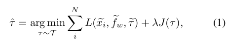

其中 L 是衡量检测器扰动的损失函数，x_i 、f_w 和 τ分别表示自集成数据、模型和补丁，J(·) 是我们在工作中使用 τ 的全变分的正则化项。

## 3.2 整体框架

如图2所示，我们将整个T-SEA管道分为训练阶段和攻击阶段。在训练阶段，首先使用受约束的数据增强来增强输入图像。随后，白盒检测器（即受攻击的检测器）用于从增强图像中定位目标对象。然后，我们将对抗性补丁贴到目标类的每个检测到的对象的中心，同时使用了patch cutout以及防止过拟合。之后，带有对抗性补丁的图像经过shake-dropped模型，我们最小化对象置信度并不断优化训练对抗性补丁直到达到最大epoch。在攻击阶段，我们在测试图像上使用经过充分优化的对抗补丁来干扰多个黑盒检测器的检测过程。 

## 3.3.增强基线

在本节中，我们介绍增强基线的细节，如算法 1 中所述。首先，我们随机初始化补丁 $τ_0$ ，准备训练图像和攻击模型 $f_w$ 。在训练时的每个epoch，对于每个输入图像批次 $X$，我们首先通过白盒检测器 $f _w$ 获得它们的检测结果。接下来，我们利用变换函数$T$ 将训练补丁应用到每个图像中，以生成对抗性图像批次 $X^{adv}$ 。接下来，我们计算 $X^{adv}$的对象置信度，以及该批次图像的攻击损失。除非另有说明，这里我们使用$l_1$ loss作为攻击损失。最后，我们通过基本攻击方法更新 τ，并在每个 epoch 后调整学习率，直到达到最大epoch。

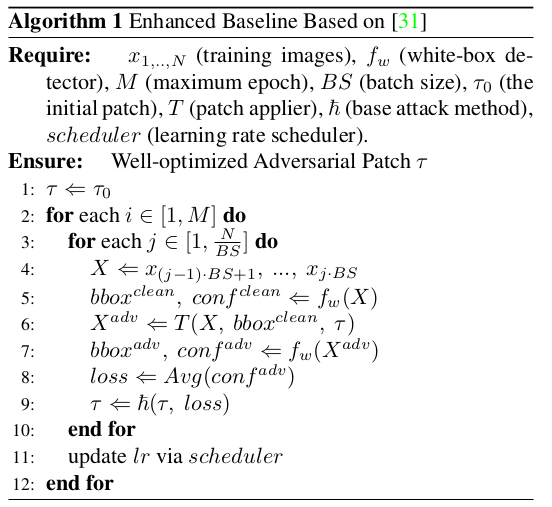

与AdvPatch[31]相比，我们稍微调整了两种训练策略。一是学习率调度器。我们观察到，补丁优化过程中的鞍点可能会导致原始的基于平台的调度器大幅降低学习率，导致优化不充分。因此，我们按照以下标准调整学习率下降策略，

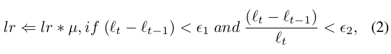

其中 $\mu$是衰减因子，$l_t$ 表示 第t个epoch时的平均损失，$ \epsilon_1$ $ \epsilon_2$ 是控制学习率更新的阈值。在我们的实验中，**我们通过上述超参数确保学习率更稳定地下降。另一个调整是减小训练阶段$s_t$ 的 patch 尺寸。这里patch比例是patch与特定对象的边界框之间的长度比。**如图4所示，适当的缩放有助于优化的patch学习更多的全局模式，当补丁缩放时，这些模式不会轻易被破坏，比如局部模式将丢失更多信息当其相应的patch缩放到非常小时。

## 3.4.自集成策略 

### 3.4.1 理论分析 

典型的模型训练通常试图从有限的假设空间 F 中找到一个映射函数 f来描述输入数据 x 和标签 y 之间的关系，遵循底层联合分布$ D(X,Y)$。一般来说，由于 D 是未知的，我们使用训练数据集 $S = {(x_i , y_i)|i = 1, ..., N } $来训练模型，这意味着优化涉及经验风险最小化(ERM)[32]：

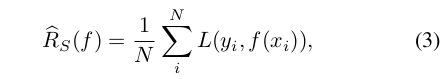

其中$L$是损失函数，用于衡量模型预测$f(x)$和标签$y$之间的差异。然而，经验风险无法对未见过的数据进行概括[39]。幸运的是，我们可以推导出,对于给定的置信度 $1 − σ \in(0, 1)$，泛化误差$R_D(f)$以$R_s(f)$ 为边界。

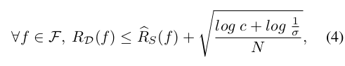

其中N表示输入数据大小，c是$F$的复杂性度量，例如VC维[24]或覆盖数[1]。

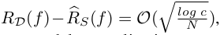

根据以上产生的泛化差距的界限，由此我们可以分析模型的泛化性：我们可以采样更多的训练数据或降低模型复杂性，以帮助缩小泛化差距。在实践中，有限的训练数据和大规模的模型参数使得模型容易过拟合[38]，导致不良的泛化差距增加。幸运的是，过去的研究在输入数据和模型上广泛采用了一系列正则化策略，例如数据增强[11,39,41]、随机深度[15]和Dropout[29]。

受前面提到的模型的正则化方法的启发，我们讨论如何去提升对抗补丁的攻击可迁移性。在补丁优化阶段，模型是作为输入而不是优化对象，这意味着原始的输入分布$D(X,Y)$被转换为联合分布$D(X,F)$.自然，我们能提升对抗补丁的泛化性通过提升训练数据规模$N_{x,f}$， 比如，采样更多的训练图像x，和集成更多的白盒模型$f_w$. 然而，对于攻击者来说，获取同一任务的大量图像或模型通常是昂贵的或不切实际的。为了解决这个问题，我们建议通过数据增强和 Shake-Drop 模型来虚拟地扩展输入，以帮助提高补丁的可转移性。同时，尽管大规模模型在大多数任务中都取得了优异的性能，但这些模型仍然受益于降低训练阶段的模型复杂性，如随机深度[15]和Dropout[29]。因此，我们提出在训练过程中使用 patch cutout 来减少其容量 $c_{\tau}$作为一种新的正则化来减轻过度拟合。

### 3.4.2 数据：约束数据增强

受数据增强增加模型泛化的启发，我们可以通过虚拟扩展训练集$S$以更接近底层分布 D 来类似地提高补丁可转移性。因此，我们采用约束策略来避免可能不会出现在自然场景中的不自然的增强。在我们的工作中，我们1）温和地调整和裁剪输入图像，2）稍微改变亮度，对比度，饱和度和色调，3）在小范围内随机旋转输入图像，以生成自然的增强图像。

### 3.4.3  模型：ShakeDrop

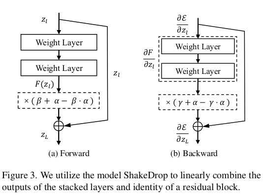

如上所述，在训练补丁时，从联合输入分布 D 中采样更多的白盒模型 f 可以提高patch的对抗性可转移性。然而，现实中很难获得同一任务的多个模型。受随机深度 [15] 的启发，随机深度随机丢弃层的子集以虚拟地集成多个模型变体以提高泛化能力，我们利用 ShakeDrop [37] 线性组合堆叠层的输出和残差块的恒等映射，生成被攻击的白盒模型的大量变体，如图 3 所示。具体来说，在前向传播中，我们将残差块的恒等层$z_l$ 和堆叠层 $F_(z_l )$ 的输出结合起来，用以下公式生成 $z_L$ ：

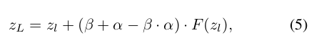

$\beta$ 从一个伯努利分布中采样得到。$\alpha$ 从一个连续均匀分布中采样得到，$α ∼ U (1 − e, 1 + e)$，e是一个常数。在反向传播中，定义损失函数为$\varepsilon$， 根据反向传播的链式法则，ShakeDrop可以表示为：

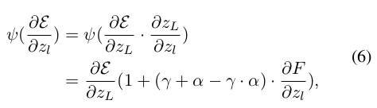

$\gamma$ 是两一个伯努利变量 与$\beta$同分布。

### 3.4.4 Patch:Cutout

Dropout [29]旨在随机丢弃神经单元及其连接，有效防止模型的过度拟合。受 Dropout 的启发，**我们提出了一种 patch cutout 策略，随机屏蔽对抗性 patch 的一个区域，以降低训练阶段的 patch 复杂性，从而防止对特定模型和数据的过度拟合。**从另一个角度来看，模型Dropout可以防止神经单元的过度共同适应，并将特征分散到多个神经元上以减轻过度拟合。同样，补丁剪裁也可以防止补丁的对抗性过于依赖某个区域的图案。所提出的补丁剪切类似于模型训练中的剪切[11]或随机擦除[41]。具体来说，对于大小为 H × W 的归一化输入图像 $I_{x,y} ∈ [0, 1]$，我们在将补丁附加到目标对象之前以概率 $\varphi_c$ 执行以下过程： 1）我们首先进行随机采样在给定的 patch 内获得一个点$ p = (x_0 , y_0 ) $； 2) 然后我们用特定值 k ∈ [0, 1] 覆盖以 p 为中心的 ηH × ηW 方形区域（η 是比率）。

# 4.实验

## 4.1 实现细节

**数据集**在我们的实验中，我们利用INRIA人物数据集[10]来训练和测试我们的对抗补丁，其训练集和测试集分别由614和288张图像组成。同时，为了验证精心制作的补丁的可转移性，我们选择包含COCO验证集中的人的图像（名为COCO-person）和人类的CCTV镜头*（名为CCTV-person）作为附加测试数据。前者包含不同场景（例如运动场、交通路线、海洋和森林）的 1684 个人物图像，后者包含来自摄像机镜头的 559 个人物图像。

**优化细节**我们使用INRIA训练集作为训练集，并将person作为目标攻击类别。补丁大小为 300 × 300，输入图像大小为 416 × 416，批量大小 BS = 8，最大epoch数 M = 1000。对于 E-baseline，我们将训练补丁规模调整为将AdvPatch[31]中的0.2改为0.15，设置学习率调度器$\epsilon_1=1e−4$、$\epsilon_2=1e−4$，并采用Adam[18]作为优化器。对于约束数据增强，我们通过水平翻转、轻微颜色抖动、随机调整裁剪大小和随机旋转来进行约束数据增强；对于模型 ShakeDrop，常数 e 设置为 1，使得$ α ∼ U (0, 2)$，并且我们以 $\varphi_s = 0.5$的概率扰动模型；对于补丁剪切，我们设置擦除区域的填充值 k = 0.5，比率 η = 0.4，概率 phi c = 0.9。 (超参数好多)

**评估指标**遵循[14, 31]，我们使用平均精度（mAP）来衡量精心设计的补丁的攻击能力（mAP越低，攻击越好），并将检测器对干净数据的预测作为ground truth（即，mAP = 1)。

## 4.2. 主要结果 

### 4.2.1 不同攻击模型的结果 

我们系统地研究了所提出的 T-SEA 在八个广泛使用的目标检测器上的攻击性能，并在表 1 中报告了定量结果。 1.由于T-SEA是在AdvPatch[31]的基础上改进的，我们也报告AdvPatch的结果。与[31]相比，所提出的T-SEA在所有八个检测器的白盒和黑盒性能上都取得了显着的改进，证明了所提出策略的有效性。同时，对于一些白盒检测器（例如YOLO v2和Faster R-CNN），黑盒平均mAP可以下降到10左右，表现出T-SEA有效的黑盒性能。

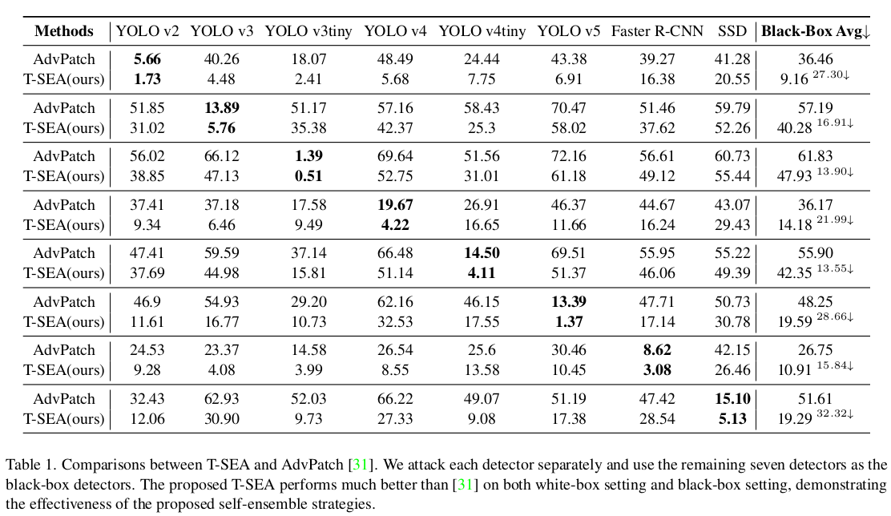

### 4.2.2 不同攻击方法的结果 

T-SEA 并非仅针对特定的基本攻击方法而设计；对于 T-SEA 来说，在不同的基础攻击方法上表现良好非常重要。在选项卡中。在图2中，我们给出了在YOLO v5上使用不同基本攻击方法的T-SEA的详细结果，其中包括基于优化的方法（例如Adam和SGD）和迭代方法（例如MIM、BIM和PGD）。结果表明，所提出的 T-SEA 可以提高上述所有方法的白盒和黑盒攻击性能，这表明 T-SEA 带来的性能增益并不限于特定方法。也就是说，T-SEA 可能会与未来的基础攻击方法很好地配合，以进一步提高其精心设计的 AdvPatch 的可转移性。

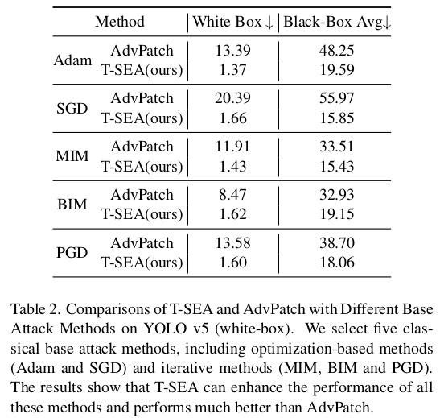

## 4.3. 与SOTA方法的比较

在本节中，我们将T-SEA与SOTA检测攻击方法进行比较，它们都将YOLO v2作为白盒模型并在七个黑盒检测器上进行评估，我们还报告了灰色/随机噪声/白色斑块作为对照组。如表3所示。1）所有对抗性补丁的表现都比对照组好得多； 2）我们的E-baseline和T-SEA在具有相同推理设置的所有对抗方法中实现了最高性能（即我们确保每种方法的扰动区域相同），这表明与现有的单模型攻击方法相比，训练策略调整和自集成策略可以有效增强精心设计的对抗性补丁的白盒和黑盒攻击能力。

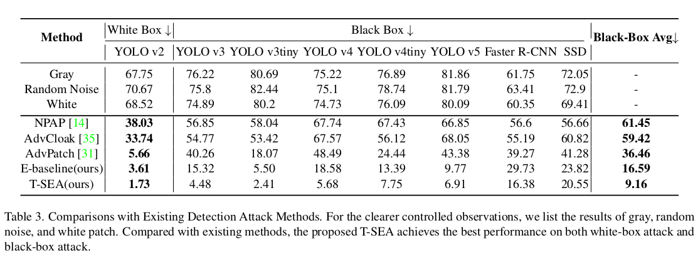

## 4.4.消融研究 

### 4.4.1 训练策略调整 

这里我们探讨训练策略调整所带来的性能增益。正如在 Sec 3.3中所讨论的。 我们修改了[31]的学习率调度器和训练补丁尺寸。如图4所示，修改后的训练尺寸可以更快更有效地降低测试集中的mAP，并且制作的补丁具有更清晰的对抗模式。调整后的调度器还可以使检测损失减少更多，并且可以进一步与修改后的训练规模相结合以获得更好的结果。

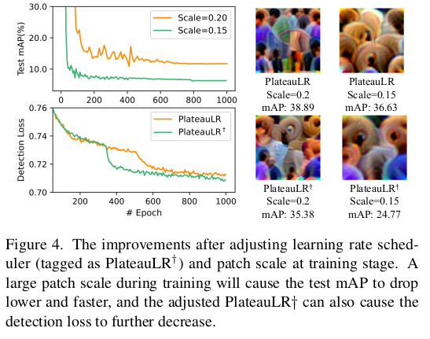

### 4.4.2 自集成策略

在这项工作中，我们受到增强泛化能力的模型训练方法的激励，我们提出了关于输入数据、攻击模型和训练补丁的自集成策略，大大增强了对抗性可从自身转移。在这里，我们在 E_baseline（YOLO v5 作为白盒检测器）上单独检查所提出的策略，以探索每个策略的影响。正如表4中所示，尽管约束数据增强会稍微降低白盒性能（其他两种策略都提高了白盒性能），但所有这些自集成策略都分别提高了黑盒结果。并将它们结合起来可以达到最佳性能。

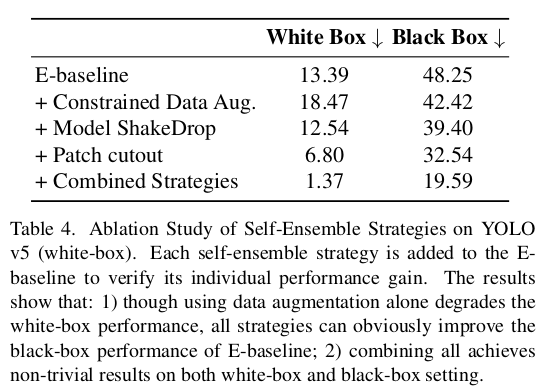

### 4.5.跨数据集验证 

执行跨数据集攻击的能力对于优化良好的补丁也很重要。在这里，我们将 INRIA 训练的补丁应用于两个不同的数据集：COCO-person 和 CCTV-person。与 INRIA 相比，COCO-person 在不同场景中拥有更多的人物图像，而 CCTV-person 则专注于安全摄像机中的人物。如表5所示，T-SEA制作的补丁在白盒设置上与AdvPatch达到了相当的结果，但在COCO-person和CCTV-person上都获得了更好的黑盒攻击能力，表明其黑盒能力很强跨数据攻击能力。

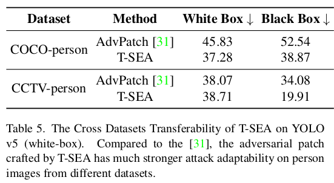

## 4.6 物理验证

尽管在物理世界中应用补丁攻击并不是我们工作的主要目标，但我们相信具有高可移植性的优化补丁可能在物理环境中表现良好。这里我们在图5中展示了一个简单的案例，iPad上显示的补丁可以成功攻击YOLO v5和SSD的人体检测，而不会干扰其他物体的检测过程。

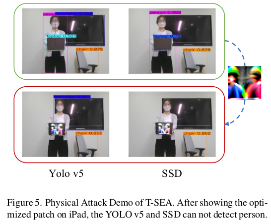

# 5.未来的工作

由于大多数现有的主流检测器都是基于 CNN 的，因此我们在这项工作中重点关注在这些检测器上应用自集成策略。然而，基于变压器的检测器[6, 22]正在取得有希望的结果，并且所提出的模型ShakeDrop不能直接应用于变压器（其他可以），我们将遵循设计模型ShakeDrop的动机，提出新的模型接近并生成基于变压器的检测器的变体。

# 6.结论

在本文中，我们提出了一种针对目标检测器的新型基于转移的自集成黑盒攻击，在多种流行的目标检测器上通过各种基础攻击方法实现了稳定且出色的性能增益。首先，仅通过轻微的训练策略调整，我们就提高了现有方法的性能，并将其作为我们的增强基线。然后，基于这个基线，我们提出了一系列自集成策略来增强输入数据、攻击模型和训练补丁本身，以显着增强优化补丁在黑盒检测器上的对抗性可转移性。综合实验结果揭示了仅使用一种模型的攻击者仍然可以成功进行高可转移性黑盒攻击的潜在风险。